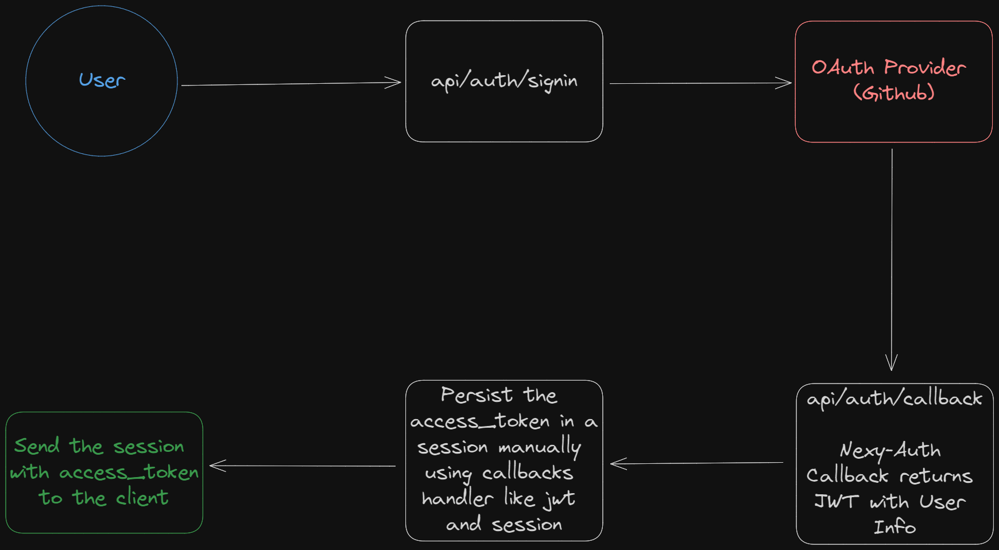

This is a Next.js App Router using Next-Auth. There are many examples such as `server session`, `protected route`, `server action`, `api from client` and `api from server`.

## Getting Started

First, run the development server:

```bash
pnpm dev
```

Open [http://localhost:3000](http://localhost:3000) with your browser to see the result.

## Next Auth Flow



## Routes

- http://localhost:3000/api/auth/session

- http://localhost:3000/api/auth/signin

- http://localhost:3000/api/auth/signout

## References

- https://next-auth.js.org/getting-started/example
- https://next-auth.js.org/getting-started/typescript
- https://next-auth.js.org/configuration/callbacks
- https://next-auth.js.org/providers/github